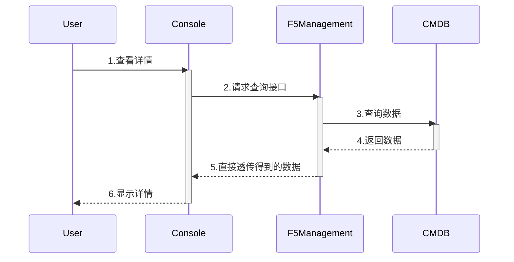
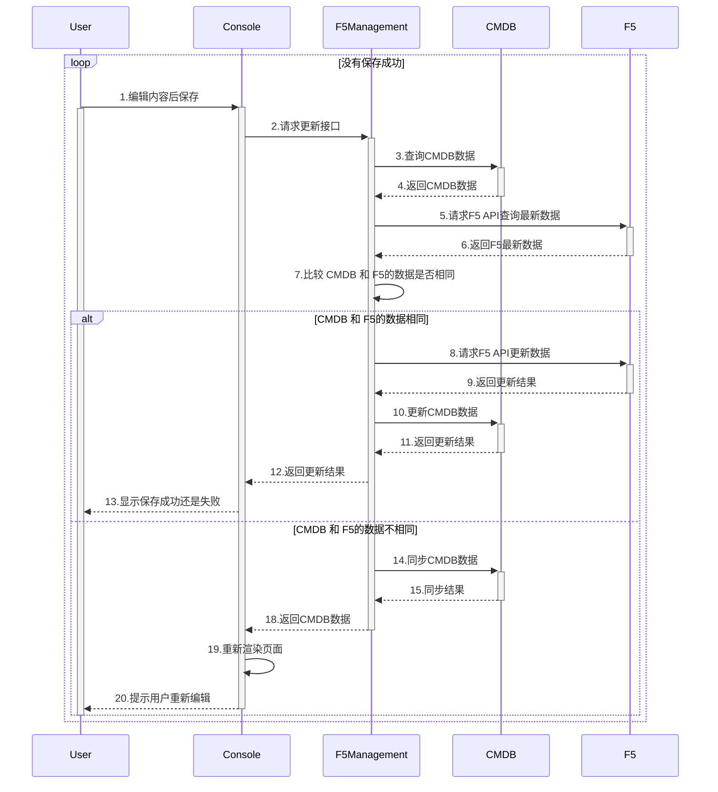

# F5管理后台设计 

### 查看操作时序图

```mermaid
sequenceDiagram

participant u as User
participant c as Console
participant m as F5Management
participant db as CMDB
#participant f as F5

u ->> c: 1.查看详情
activate c
c ->> m: 2.请求查询接口
activate m
m ->> db: 3.查询数据
activate db
db -->> m: 4.返回数据
deactivate db

m -->> c: 5.直接透传得到的数据
#Note over m, c:直接从 CMDB 取数据?为了后续扩展还是透传好

deactivate m
c -->> u: 6.显示详情
deactivate c

```

### 编辑操作时序图

```mermaid
sequenceDiagram

participant User
participant Console
participant F5Management
participant  CMDB
participant  F5
loop 没有保存成功
	User ->>+ Console: 1.编辑内容后保存
	activate User
	Console ->>+ F5Management: 2.请求更新接口
	F5Management ->>+ CMDB: 3.查询CMDB数据
	CMDB -->>- F5Management: 4.返回CMDB数据
	F5Management->>+F5: 5.请求F5 API查询最新数据
	F5 -->>- F5Management: 6.返回F5最新数据

	F5Management ->> F5Management: 7.比较 CMDB 和 F5的数据是否相同

	alt CMDB 和 F5的数据相同
	    F5Management->>+F5: 8.请求F5 API更新数据
	    F5 -->>- F5Management: 9.返回更新结果
        F5Management ->>+ CMDB: 10.更新CMDB数据
	    CMDB -->>- F5Management: 11.返回更新结果
	    F5Management -->> Console: 12.返回更新结果
	    Console -->> User: 13.显示保存成功还是失败
	else CMDB 和 F5的数据不相同
        F5Management ->>+ CMDB: 14.同步CMDB数据
	    CMDB -->>- F5Management: 15.同步结果
	    #F5Management ->>+ CMDB: 16.查询数据
	    #CMDB -->>- F5Management: 17.返回数据
	    F5Management -->> Console: 18.返回CMDB数据
	    deactivate F5Management
	    Console ->> Console: 19.重新渲染页面
	    Console -->> User: 20.提示用户重新编辑
	    deactivate Console
	end

	deactivate User


end


```

### 自动发现
<!--stackedit_data:
eyJoaXN0b3J5IjpbMTAzMTY1NjA0Nl19
-->